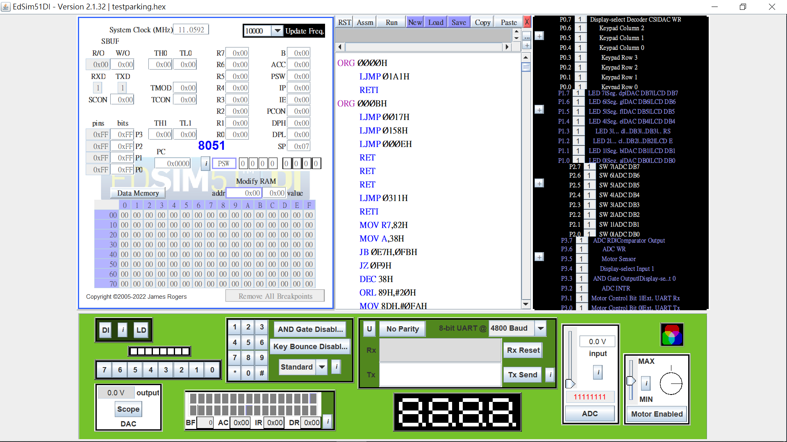
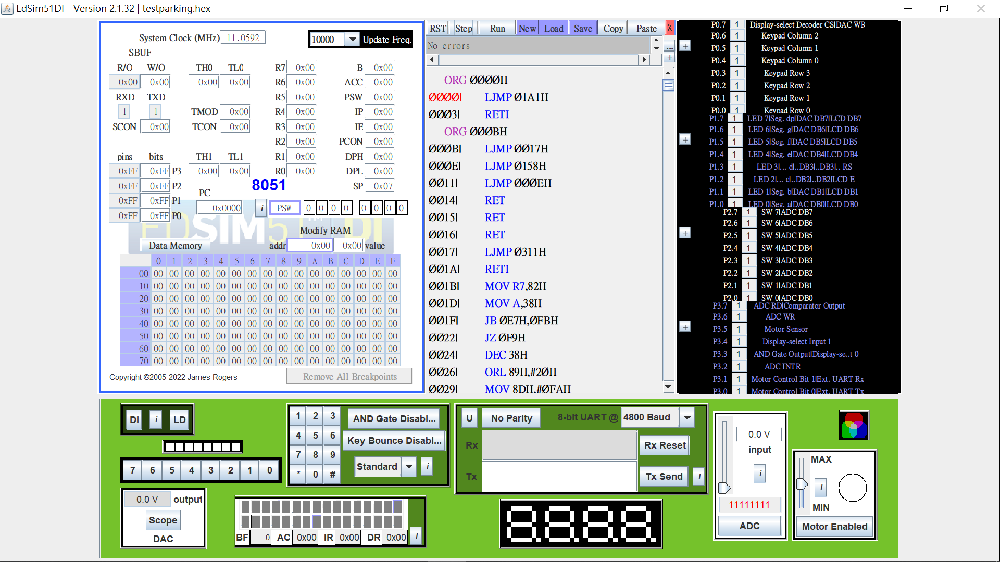
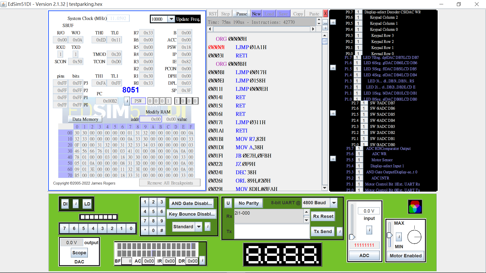

# <div id="top"></div>

# Thread Package on Edsim51


<!--  -->

## Table of contents

  - [About the project](#about-the-project)
  - [How to run this project](#how-to-run-this-project)
    - [Prerequisites](#prerequisites)
    - [Simulation](#simulation)
  - [Reference](#reference)
  - [Contact](#contact)


## About the project

This is an implementation of a multi-threading package in C language which targets Edsim51 simulator. This project consists of five checkpoints, each with a different test case

+ checkpoint 1: cooperative thread-switching 
+ checkpoint 2: preemptive thread-switching 
+ checkpoint 3: semaphore + bounded-buffer test case
+ checkpoint 4: two producers & one consumer test case
+ checkpoint 5: delay function + parking lot test case

<p align="right">(<a href="#top">back to top</a>)</p>


## How to run this project

### Prerequisites

One needs Edsim51 to simulate 8051 processor and SDCC to generate Edsim51-targeted files

- [SDCC](http://sdcc.sourceforge.net/)
	- Small device C compiler
	- Open source, free, cross-platform
	- Default ISA is Intel mds51

- [Edsim51](http://www.edsim51.com/)
	- An 8051 microcontroller simulator
	- Runs as a Java app 
	- DI version - simulates a complete embedded system
	- SH version - customizable 

### Simulation

To get a local copy up and running follow these simple steps.

1. clone the repo

   ```sh
   git clone https://github.com/bob1113/thread-pkgs-on-edsim51.git
   ```

2. Change into checkpoint directory and compile via run `make`
	```console
	$make
	sdcc -c  testparking.c
	testparking.c:47: warning 158: overflow in implicit constant conversion
	testparking.c:73: warning 158: overflow in implicit constant conversion
	sdcc -c  preemptive.c
	preemptive.c:194: warning 85: in function ThreadCreate unreferenced function argument : 'fp'
	sdcc  -o testparking.hex testparking.rel preemptive.rel
	```
	The warnings above can be ignored.

3. Choose the generated `.hex` file and click `Load` to load it into Edsim51
	<p align="center">
		
	</p>
4. Click `Assm` to convert `.hex` file into assembly file
	<p align="center">
		
	</p>
5. Click `Run` to execute
	<p align="center">
		
	</p>
6. After finishing the simulation, one may clean up the generated files via run `make clean`
	```console
	$make clean
	del *.hex *.lst *.map *.mem *.rel *.rst *.sym *.asm *.lk
	```

<p align="right">(<a href="#top">back to top</a>)</p>


## Reference

+ [MCS® 51 Microcontroller Family User's Manual](http://web.mit.edu/6.115/www/document/8051.pdf)

<p align="right">(<a href="#top">back to top</a>)</p>


## Contact

Bob Lai - [bobolai1113@gmail.com](bobolai1113@gmail.com) \
Project Link - [https://github.com/bob1113/thread-pkgs-on-edsim51](https://github.com/bob1113/thread-pkgs-on-edsim51)

<p align="right">(<a href="#top">back to top</a>)</p>